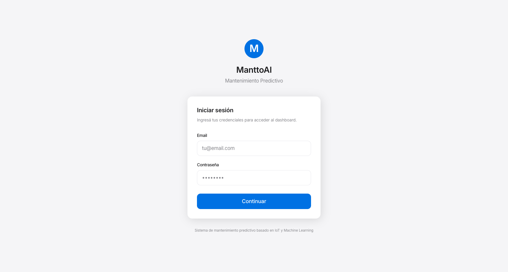
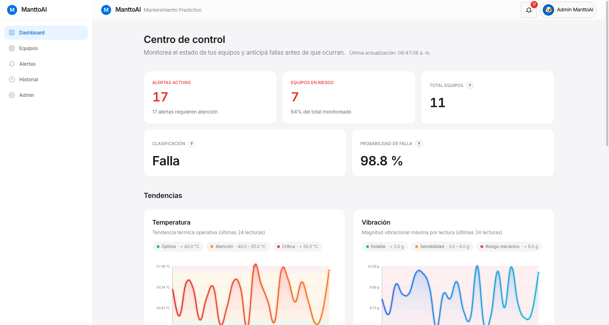
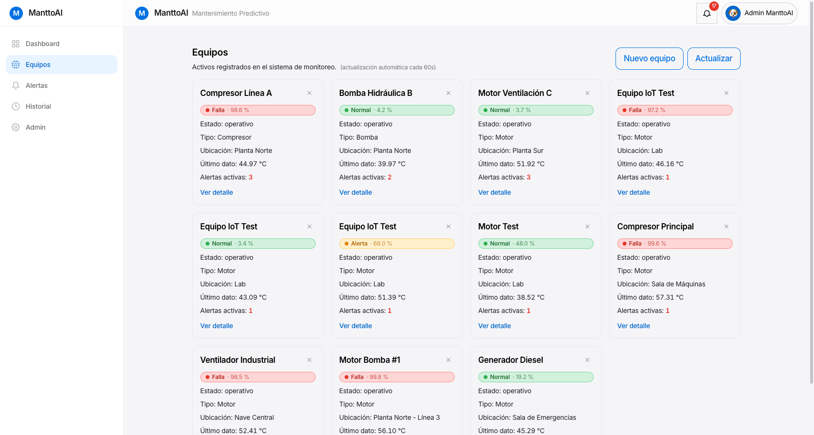
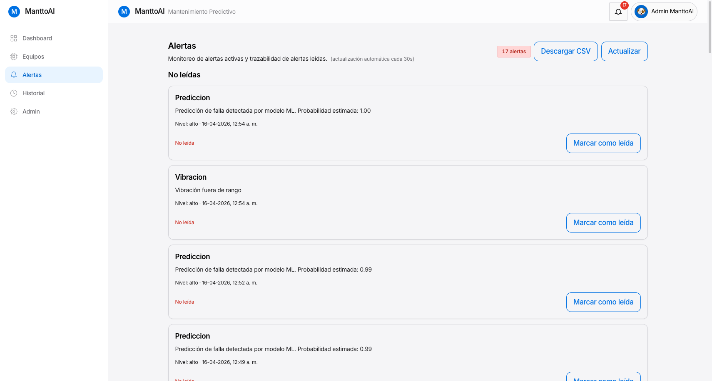
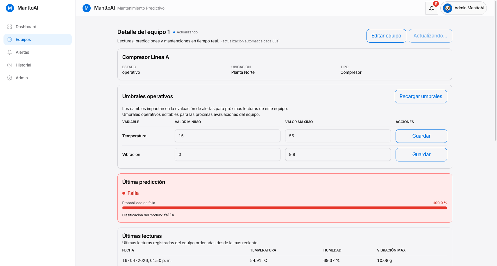
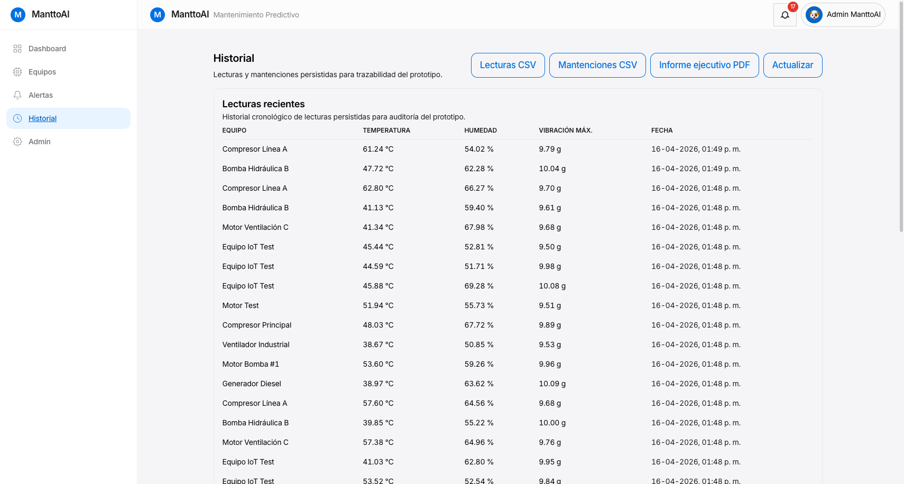

# ManttoAI — Plataforma de Monitoreo IoT por Rubro


**ManttoAI** es una plataforma open-source de monitoreo IoT que captura telemetría en tiempo real desde dispositivos ESP32 vía MQTT, evalúa umbrales operacionales y ejecuta un modelo de Machine Learning (Random Forest) para predecir fallas en los equipos. Organizada por rubro económico (industrial, agrícola, comercial), proporciona un dashboard web interactivo para la gestión integral de equipos y mantenimiento preventivo.

> **Estado actual:** Prototipo académico funcional (INACAP, PMBOK). Esta
> revisión implementa localmente los blockers de seguridad/operabilidad y deja
> el blueprint Render/Vercel preparado. No hay URL pública verificada todavía.

---

## El Problema

El mantenimiento reactivo de equipos industriales es costoso: cuando un equipo falla sin avisar, se generan paros de producción, costos de reparación de emergencia y pérdida de datos operacionales. Las organizaciones pequeñas y medianas carece de acceso a sistemas SCADA caros o soluciones IoT empresariales que permitan **monitoreo predictivo a bajo costo**.

ManttoAI resuelve esto con una arquitectura minimalista y asequible:
- Hardware de bajo costo (ESP32 + sensores básicos, ~$50–100 USD por nodo).
- Inferencia ML ligera y explicable (Random Forest, no deep learning).
- Dashboard intuitivo con alertas en tiempo real.
- Despliegue sencillo en una VPS compartida.

---

## Inicio Rápido (Local)

Ejecuta toda la plataforma localmente en minutos con Docker Compose. No requiere dependencias externas ni cuentas en la nube.

### Requisitos previos
- Docker y Docker Compose V2
- GNU Make

### Pasos

```bash
# 1. Clonar repositorio
git clone https://github.com/sebitabravo/ManttoAI.git
cd ManttoAI

# 2. Generar configuración local y credenciales
make setup-env

# 3. Levantar stack completo (Backend, Frontend, MySQL, Mosquitto)
make up

# 4. Cargar datos de ejemplo y activar simulador
make seed
make simulate

# 5. Acceder
# Frontend: http://localhost:5173
# API Docs: http://localhost:8000/docs
# Credenciales: admin@manttoai.local (contraseña en backend/.env)
```

Para detener:
```bash
make down
```

---

## Características

- **📡 Telemetría IoT en Tiempo Real** — Integración nativa MQTT (Mosquitto). Captura temperatura, humedad y vibración (x/y/z) desde ESP32 o simulador.
- **🧠 Predicciones con Machine Learning** — Random Forest pre-entrenado con 94.13% de accuracy y 93.04% F1-Score en validación. Evalúa riesgo de falla por equipo.
- **🚨 Alertas Inteligentes** — Detección automática de umbrales excedidos y anomalías de predicción. Notificaciones por email (vía Mailpit en demo, SMTP en producción).
- **📊 Dashboard Interactivo** — SPA en React con auto-refresh, gráficos de tendencias, historial de lecturas y gestión centralizada de equipos.
- **🛠️ Simulador IoT Integrado** — Generador de telemetría realista 24/7 para demo y testing sin hardware físico.
- **🤖 Asistente de Mantenimiento** — Chat híbrido (reglas + LLM con Ollama) para consultas técnicas de operadores.
- **📝 Auditoría Completa** — Logs de acceso, cambios de configuración y decisiones de ML para trazabilidad académica y operacional.

---

## Stack Tecnológico

| Capa | Tecnología | Justificación |
|---|---|---|
| **Frontend** | React 18 + Vite + Tailwind + Axios | SPA moderna, sin build lento, styling utility-first |
| **Backend** | FastAPI + SQLAlchemy + Pydantic v2 | Async nativo, validación tipada, OpenAPI automático |
| **Base de datos** | MySQL 8 | Relacional, estable, bajo overhead |
| **Mensajería** | Eclipse Mosquitto (MQTT) | Protocolo ligero para IoT, bajo ancho de banda |
| **Machine Learning** | Scikit-learn + Pandas + Numpy | Modelos interpretables, determinísticos, sin GPU needed |
| **Infraestructura** | Docker Compose, Nginx | Portabilidad, escalabilidad horizontal simple |
| **IoT** | ESP32 DevKit v1 + DHT22 + MPU-6050 | Bajo costo, Wi-Fi built-in, C++ bien soportado |
| **Testing** | pytest (backend), Vitest + Playwright (frontend) | Cobertura completa, trazabilidad en CI/CD |

---

## Métricas de Machine Learning

### Modelo Random Forest
- **Tipo:** Clasificación binaria (equipo en riesgo / equipo sano)
- **Datos de entrenamiento:** 12,000 lecturas sintéticas (9,600 train / 2,400 test)
- **Configuración:** 120 estimadores, profundidad máxima 10, seed 42

### Desempeño en validación
| Métrica | Valor |
|---------|-------|
| **Precisión (Accuracy)** | **94.13%** |
| **F1-Score** | **93.04%** |
| **Precisión (de clase positiva)** | 93.64% |
| **Recall** | 92.44% |
| **CV F1-Score (media ± std)** | 92.52% ± 0.72% |

**Interpretación:** El modelo identifica correctamente el 94% de los casos (equipos en riesgo vs. sanos) y balancean precisión y exhaustividad en 93%, superando el umbral académico mínimo (80%).

---

## Arquitectura

```
┌─────────────────┐         ┌──────────────┐
│  ESP32 nodos    │──MQTT──▶│  Mosquitto   │
│  + Simulador    │         │   (Broker)   │
└─────────────────┘         └──────┬───────┘
                                   │
                        ┌──────────▼───────────┐
                        │   FastAPI Backend    │
                        │  ├─ Routers (HTTP)   │
                        │  ├─ Services (logic) │
                        │  ├─ ML Inference     │
                        │  └─ Email/Alertas    │
                        └──────────┬───────────┘
                                   │
                    ┌──────────────┼──────────────┐
                    │              │              │
              ┌─────▼────┐    ┌────▼─────┐  ┌───▼───┐
              │  MySQL 8 │    │ RandomF.  │  │ Mailpit
              │ (datos)  │    │ joblib    │  │(email)
              └──────────┘    └──────────┘  └───────┘

┌──────────────┐
│React Dashboard    │◀──/api/*─ Nginx ◀─ FastAPI
│ + Tailwind  │
└──────────────┘
```

Para detalle narrativo completo: [`docs/arquitectura-manttoai.md`](../arquitectura-manttoai.md).

---

## Estado del Proyecto

### Funcionalidad
- ✅ Captura MQTT y persistencia de lecturas
- ✅ Dashboard web (listado, detalle, alertas, historial)
- ✅ Predicciones ML en tiempo real
- ✅ Notificaciones por email
- ✅ Simulador IoT integrado
- ✅ Sistema de autenticación (JWT + CSRF)
- ✅ API REST completa con OpenAPI/Swagger
- ✅ Audit logs y trazabilidad

### Calidad
La evidencia vigente se genera con los comandos del workspace y se registra en
`docs/auditoria/estado-implementacion.md`. No conservar números históricos como
si fueran una corrida posterior a este patch.

### Deploy
- **Entorno local/Docker:** ✅ validado por tests y configuración; la verificación
  completa de contenedores depende de Docker/MySQL disponibles.
- **URL pública con HTTPS:** ⏳ blueprint preparado, no desplegado/verificado.

> **Nota para reclutadores:** El sistema es demostrable localmente con
> `make setup-env`, `make up` y `make seed`. La URL pública se agregará solo
> después de verificar el flujo externo completo.

---

## Estructura del Repositorio

```
ManttoAI/
├── backend/                # FastAPI app, ML, lógica de negocio
│   ├── app/
│   │   ├── routers/       # Endpoints HTTP (/auth, /equipos, /alertas, etc.)
│   │   ├── services/      # Lógica: MQTT, alertas, predicciones, email
│   │   ├── models/        # SQLAlchemy ORM
│   │   ├── ml/            # Random Forest, scoring, inferencia
│   │   ├── schemas/       # Pydantic DTOs
│   │   └── main.py        # FastAPI app + lifespan
│   ├── tests/             # Suite completa (85% coverage)
│   ├── docker-entrypoint.sh
│   └── requirements.txt
│
├── frontend/              # React SPA
│   ├── src/
│   │   ├── components/   # Componentes React reutilizables
│   │   ├── pages/        # Rutas principales (Login, Dashboard, Equipos, etc.)
│   │   ├── hooks/        # Custom hooks (useAuth, useFetch)
│   │   ├── services/     # Axios client
│   │   ├── styles/       # Tailwind + CSS global
│   │   └── App.jsx       # Router principal
│   ├── tests/            # Vitest + Playwright
│   └── package.json
│
├── iot/                   # Firmware y simulador
│   ├── esp32-firmware/    # C++ para microcontrolador
│   ├── simulator/         # Generador MQTT Python
│   └── README.md
│
├── mosquitto/            # Config MQTT
│   ├── mosquitto.conf    # Broker config
│   └── passwd            # Credenciales (generadas por setup-env)
│
├── scripts/              # Utilidades operacionales
│   ├── setup-env.sh      # Inicialización de variables
│   ├── seed.sh           # Datos de ejemplo
│   ├── smoke_test.sh     # Health check rápido
│   └── deploy.sh         # Helper de despliegue
│
├── docs/                 # Documentación
│   ├── arquitectura.md   # Breve (este file)
│   ├── arquitectura-manttoai.md  # Narrativo completo
│   ├── manual-usuario.md # Guía paso-a-paso para demo
│   ├── api-endpoints.md  # Contrato HTTP completo
│   ├── gestion-proyecto/ # Artefactos PMBOK
│   └── screenshots/      # Capturas de pantalla del UI
│
├── docker-compose.yml    # Orquestación local
├── Makefile             # Comandos convenientes
└── README.md            # Este archivo (repo actual)
```

---

## Capturas de Pantalla

### Login


### Dashboard Principal
Resumen de equipos, alertas activas y últimas predicciones.


### Listado de Equipos
Tabla con estado, ubicación y última lectura.


### Panel de Alertas
Alertas no leídas y historial, con filtros.


### Detalle de Equipo
Lecturas en tiempo real, historial, predicciones y mantenimientos.


### Historial y Tendencias
Gráficos de evolución de sensores.


---

## Cómo Contribuir

Este es un proyecto open-source. Si eres ingeniero/a interesado/a:

1. **Revisa las [Issues](https://github.com/sebitabravo/ManttoAI/issues)** para tareas abiertas.
2. **Haz un fork** y crea una rama feature (`feature/tu-idea`).
3. **Pasa los linters:** `make lint`
4. **Pasa los tests:** `make test` (cobertura mínima 80%)
5. **Abre un Pull Request** con descripción clara.

**Convenciones:**
- Commits: `feat(scope)`, `fix(scope)`, `docs(scope)` (Conventional Commits)
- Código: snake_case (Python), camelCase (JavaScript)
- Tests: obligatorios para funcionalidad nueva o bug fixes

---

## Comandos Útiles

```bash
# Desarrollo
make setup-env        # Generar .env y credenciales
make up               # Levantar toda la plataforma
make down             # Detener todos los servicios
make seed             # Cargar datos de ejemplo
make simulate         # Activar simulador MQTT

# Testing
make test             # Ejecutar suite backend (pytest)
make coverage         # Reporte de cobertura
make lint             # Linting (black, isort, ruff)

# Utilidad
make smoke-test       # Health check rápido
make logs             # Ver logs en tiempo real
make clean            # Limpiar artefactos locales

# Backend directo
cd backend
uvicorn app.main:app --reload --port 8000

# Frontend directo
cd frontend
npm install
npm run dev
```

---

## Contexto Académico

**Este proyecto se originó como Proyecto de Título en INACAP:**
- **Institución:** INACAP (Instituto Nacional de Capacitación)
- **Curso:** Gestión de Proyectos Informáticos (PMBOK 6ta Edición)
- **Equipo:** Sebastián Bravo (Arquitectura, Backend, Deploy), Luis Loyola (Frontend, Negocios), Ángel Rubilar (Hardware, ML)
- **Documentación PMBOK:** [`docs/gestion-proyecto/INDEX.md`](../gestion-proyecto/INDEX.md) (Acta, EDT, RACI, Plan de Costos, etc.)

El proyecto incluye también un **plan de negocios formal** (Evaluación 3 — Gestión de Costos) que proyecta ManttoAI como empresa real con modelo freemium y proyección a 3 años.

Para evaluadores académicos o acceso a artefactos formales: ver la carpeta [`docs/gestion-proyecto/`](../gestion-proyecto/).

---

## Preguntas Frecuentes

**P: ¿Puedo ejecutar esto sin Docker?**

R: Sí. Backend requiere Python 3.11+, Frontend requiere Node.js 18+. Ver `backend/README.md` y `frontend/README.md` para setup manual.

**P: ¿Puedo usar esto con hardware real (ESP32)?**

R: Sí. El firmware C++ en `iot/esp32-firmware/` se compila con Arduino IDE o PlatformIO. Actualiza la MAC en la configuración del dispositivo.

**P: ¿Cuál es el costo de infraestructura?**

R: Para el prototipo académico actual (MySQL + FastAPI + Nginx en una sola VPS), ~$5/mes en DigitalOcean. El plan de negocios proyecta ~$30/mes en PostgreSQL gestionada + Spaces (escalable).

**P: ¿El modelo ML se puede reentrenar?**

R: Sí, los scripts de entrenamiento están en `backend/app/ml/train.py`. Puedes usar tus propios datos o los sintéticos por defecto.

**P: ¿Hay un sitio de demostración público?**

R: No en este momento. Ejecuta `make up` localmente para una demo funcional. Una URL pública será agregada aquí una vez completados los protocolos de seguridad.

---

## Licencia

[Consulta LICENSE](../../LICENSE)

---

**Mantenido por el equipo ManttoAI. Código abierto para la comunidad académica y profesional.**

Para preguntas o issues: [GitHub Issues](https://github.com/sebitabravo/ManttoAI/issues)
