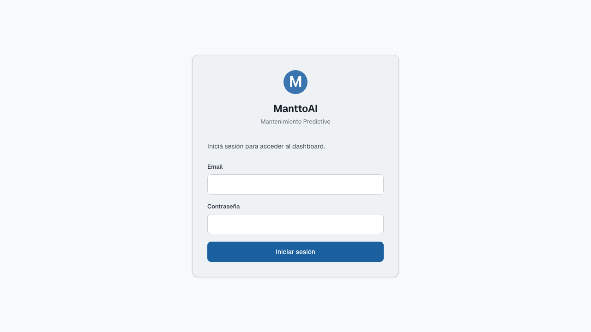
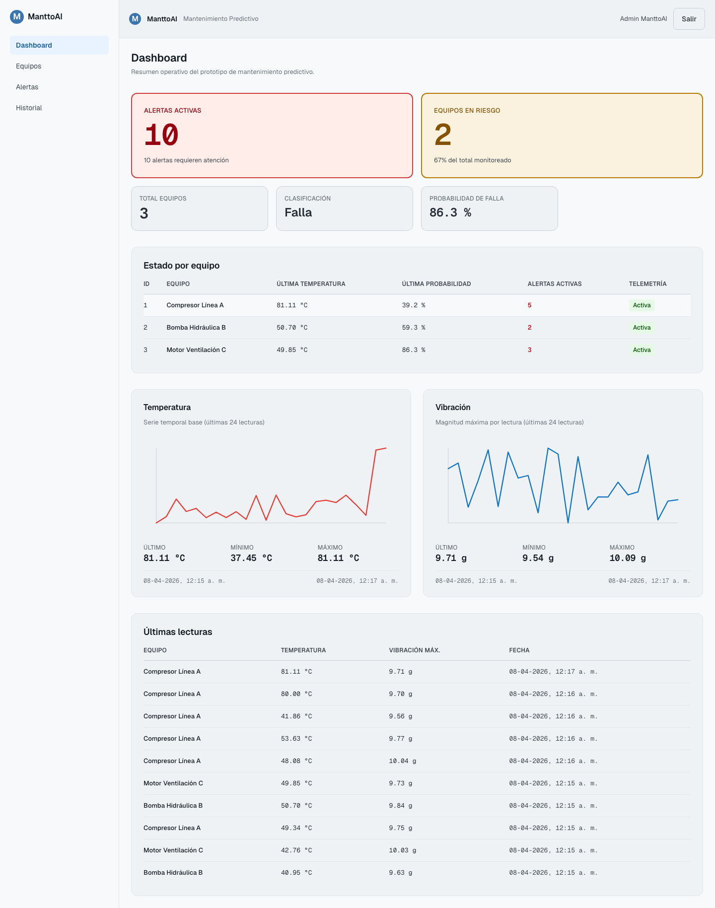
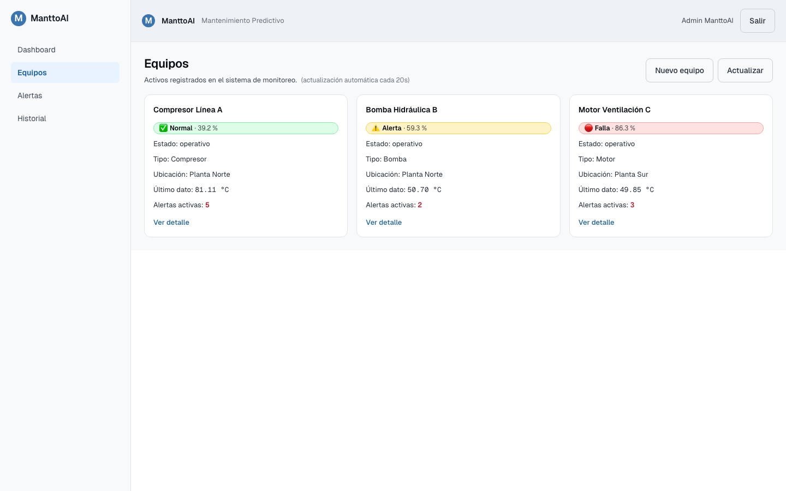
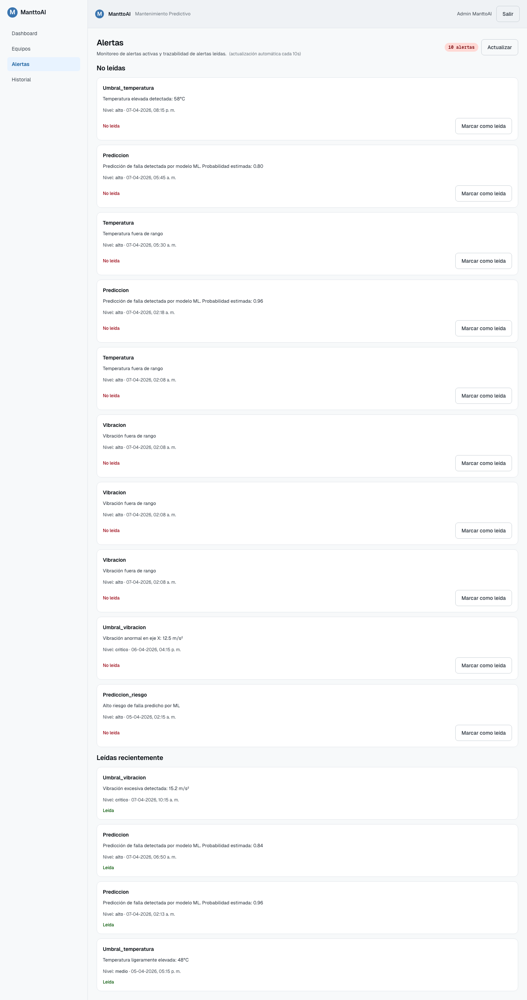

# Manual de Usuario — ManttoAI

Manual operativo paso-a-paso para usar el MVP web durante demo académica y operación cotidiana.

> **Audiencia:** evaluador académico, operador de mantenimiento simulado, cualquier integrante del equipo previo a una demo.

---

## 0. Antes de empezar (checklist)

Antes de operar el sistema, verificar:

- [ ] Backend corriendo en `http://localhost:8000` (`uvicorn app.main:app --reload --port 8000`).
- [ ] Frontend corriendo en `http://localhost:5173` (`npm run dev` en `frontend/`).
- [ ] Mosquitto broker activo (`docker compose up mosquitto -d`).
- [ ] Datos seed cargados (`make seed`).
- [ ] Smoke test verde (`bash scripts/smoke_test.sh`).

Si alguno falla, ver `README.md` de la raíz del repositorio.

---

## 1. Acceso a la aplicación

### 1.1 Login

1. Abrir el navegador en `http://localhost:5173`.
2. Ingresar credenciales demo:
   - **Email:** `admin@manttoai.local`
   - **Contraseña:** valor de `SEED_ADMIN_PASSWORD` en `backend/.env`
3. Pulsar **Iniciar sesión**.
4. Si las credenciales son válidas, redirige a `/dashboard`.

> Si las credenciales fueron modificadas en seed, usar las que estén actualmente en `backend/.env`. Estas credenciales son **solo** para entorno académico/demo.

**Captura — pantalla de login**



### 1.2 Cerrar sesión
1. Click en el avatar (esquina superior derecha).
2. Seleccionar **Cerrar sesión**.
3. El sistema invalida el token y redirige a `/login`.

---

## 2. Dashboard — vista general

### 2.1 Qué muestra
- Total de equipos monitoreados.
- Alertas activas (no leídas).
- Equipos en riesgo (según última predicción).
- Clasificación / probabilidad de falla más reciente.

### 2.2 Paso a paso de revisión diaria

1. Verificar que `total_equipos > 0`. Si es 0 → revisar seed.
2. Mirar `alertas_activas`. Si hay alertas, ir al **Paso 4 — Atender alerta**.
3. Mirar `equipos_en_riesgo`. Si cambió respecto a sesión anterior, ir al **Paso 3 — Detalle de equipo**.
4. Confirmar que la última predicción es de **menos de 24 h**. Si no, ejecutar predicción manual (ver §6.2).

**Captura — dashboard principal**



---

## 3. Equipos y detalle

### 3.1 Listado
1. Click en **Equipos** en la barra lateral.
2. Se despliega tabla con: ID, nombre, ubicación, estado actual, última lectura.
3. Filtrar (opcional) por ubicación o estado.

**Captura — listado de equipos**



### 3.2 Detalle de un equipo
1. Click en la fila del equipo de interés.
2. Pestaña **Lecturas:** revisar últimas mediciones de temperatura, humedad y vibración (x/y/z).
3. Pestaña **Predicciones:** revisar histórico de probabilidades de falla y la última clasificación.
4. Pestaña **Mantenimientos:** revisar intervenciones registradas.

### 3.3 Verificar salud de un equipo (procedimiento operativo)
1. Confirmar que la **última lectura es < 5 min**.
2. Confirmar que ningún valor está fuera de umbral configurado.
3. Confirmar que la **última predicción ≠ "riesgo alto"**.
4. Si los 3 puntos están OK → equipo sano.

---

## 4. Alertas — atender una alerta

### 4.1 Listado
1. Click en **Alertas** en la barra lateral.
2. Las alertas no leídas aparecen marcadas con punto azul.

**Captura — panel de alertas**



### 4.2 Procedimiento de atención (paso a paso)

1. Abrir la alerta más antigua **no leída**.
2. Leer **tipo** (umbral excedido / predicción alta / falla MQTT) y **mensaje**.
3. Click en el equipo asociado para abrir su detalle.
4. Validar la causa:
   - Si **umbral**: confirmar lectura y decidir si requiere mantenimiento.
   - Si **predicción**: revisar últimas 20 lecturas y patrón de variación.
   - Si **falla MQTT**: verificar conectividad del simulador / dispositivo.
5. Si requiere intervención, ir al **§5 — Registrar mantenimiento**.
6. Volver al panel de alertas y marcar como **Leída**.
7. La alerta sale de la bandeja activa pero queda en historial.

---

## 5. Registrar mantenimiento

1. Desde el detalle del equipo → pestaña **Mantenimientos**.
2. Click en **+ Nuevo mantenimiento**.
3. Completar formulario:
   - Tipo (preventivo / correctivo)
   - Descripción de la intervención
   - Fecha (default: hoy)
   - Técnico responsable
4. Pulsar **Guardar**.
5. El mantenimiento queda asociado al equipo y aparece en el historial.

> Buena práctica: si el mantenimiento se origina por una alerta, mencionar el ID de alerta en la descripción para trazabilidad.

---

## 6. Historial y reportes

### 6.1 Revisar historial
1. Click en **Historial** en la barra lateral.
2. Seleccionar equipo (opcional).
3. Seleccionar rango de fechas (default: últimos 7 días).
4. Visualizar gráfico de lecturas + lista de mantenimientos.

### 6.2 Ejecutar una predicción manual
Útil cuando la última predicción es antigua o se quiere validar tras una corrección:

1. Identificar el `equipo_id` desde el listado.
2. Desde terminal o cliente HTTP, ejecutar:
   ```bash
   curl -X POST http://localhost:8000/predicciones/ejecutar/{equipo_id} \
     -H "Authorization: Bearer <token>"
   ```
3. Refrescar la pestaña **Predicciones** del equipo.
4. La nueva predicción aparece con timestamp actual.

> En entorno demo, el token se obtiene del request de login (DevTools → Network → `/auth/login`).

---

## 7. Flujo recomendado de uso en demo académica

Secuencia ideal para presentación al evaluador:

1. **Preparación (5 min antes):**
   - `make seed`
   - `make simulate` (genera lecturas en vivo)
   - Verificar dashboard y alertas
2. **Demo en vivo:**
   1. Login con credenciales demo.
   2. Mostrar Dashboard y explicar KPIs.
   3. Abrir Equipo → mostrar lecturas en tiempo real.
   4. Provocar una alerta (simulador supera umbral).
   5. Atender la alerta paso a paso (§4.2).
   6. Registrar mantenimiento ficticio (§5).
   7. Ejecutar predicción manual (§6.2).
   8. Mostrar Historial.
   9. Cerrar sesión.

---

## 8. Resolución de problemas frecuentes

| Síntoma | Causa probable | Acción |
|---------|----------------|--------|
| `total_equipos = 0` | Seed no cargado | Ejecutar `make seed` |
| No llegan lecturas nuevas | Simulador o broker caído | `docker compose ps` y reiniciar |
| Login devuelve 401 | Contraseña distinta a `.env` | Re-leer `backend/.env` |
| Frontend en blanco | Backend caído | Verificar `http://localhost:8000/health` |
| Alertas no aparecen | Umbrales mal configurados | Revisar tabla `umbrales` en BD |

---

## 9. Buenas prácticas de operación

- No usar el entorno demo contra datos productivos reales.
- Capturar pantallas durante la demo para anexar al informe final.
- Antes de toda presentación, ejecutar `bash scripts/smoke_test.sh`.
- Documentar incidencias en `docs/decisiones/` si afectan al diseño.
- No compartir las credenciales demo fuera del equipo.
