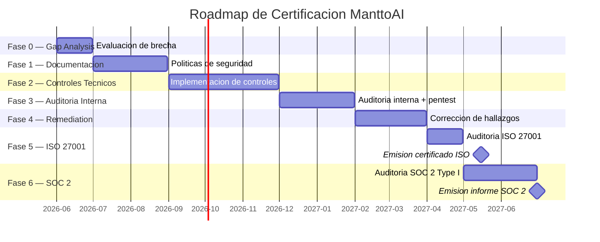
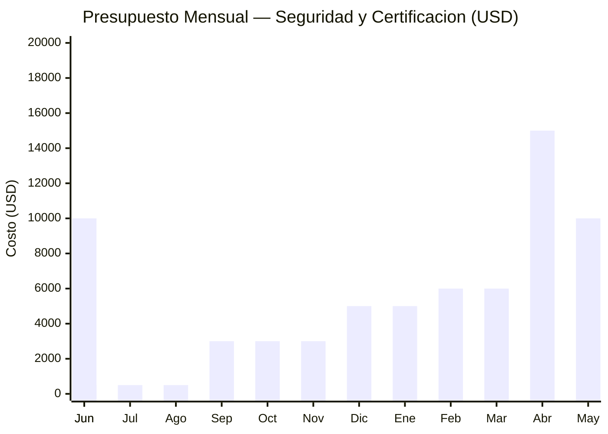

# Roadmap de Certificacion — ISO 27001 y SOC 2 Type I

- **Version:** 1.0
- **Fecha:** 2026-06-09
- **Clasificacion:** Confidencial — Solo equipo directivo
- **Aprobado por:** Director de Proyecto — ManttoAI

---

## 1. Resumen Ejecutivo

ManttoAI planifica obtener las certificaciones **ISO/IEC 27001:2022** y **SOC 2 Type I** como parte de su estrategia de consolidacion comercial (Ano 3 del plan de negocios). Estas certificaciones son requisitos habilitantes para contratar con clientes corporativos que exigen estandares de seguridad demostrables en sus proveedores de tecnologia.

| Certificacion | Timeline | Costo estimado | Auditores sugeridos |
|---|---|---|---|
| ISO 27001:2022 | 12 meses | USD 15,000 - 30,000 | BDO, Deloitte, EY |
| SOC 2 Type I | 6 meses | USD 10,000 - 20,000 | BDO, Deloitte, EY |

**Estrategia:** ISO 27001 primero (sienta las bases del SGSI), luego SOC 2 Type I (aprovecha los mismos controles).

---

## 2. Fases del Roadmap

### Fase 0: Evaluacion Inicial (Gap Analysis)

**Duracion:** 1 mes (Junio 2026)
**Costo:** Interno (sin costo directo)

| Actividad | Entregable | Responsable |
|---|---|---|
| Evaluacion de brecha ISO 27001 | [00-gap-assessment.md](./00-gap-assessment.md) | Director de Proyecto |
| Evaluacion de brecha SOC 2 Type I | Checklist de 24 controles | Director de Proyecto |
| Identificacion de activos de informacion | Inventario de activos | Equipo completo |
| Definicion de presupuesto de remediacion | Presupuesto aprobado | Director de Proyecto |

### Fase 1: Documentacion del SGSI

**Duracion:** 2 meses (Julio - Agosto 2026)
**Costo:** Interno (sin costo directo)

| Documento | ISO 27001 Ref. | Estado |
|---|---|---|
| Politica de seguridad de la informacion | A.5 | [Completado](./01-politica-seguridad-informacion.md) |
| Politica de control de acceso | A.9 | [Completado](./02-politica-control-acceso.md) |
| Politica de backup y recuperacion | A.12.3 | [Completado](./03-politica-backup-recuperacion.md) |
| Politica de desarrollo seguro | A.14.2 | [Completado](./04-politica-desarrollo-seguro.md) |
| Procedimiento de respuesta a incidentes | A.16 | Pendiente |
| Plan de continuidad del negocio (BCP) | A.17 | Pendiente |
| Procedimiento de gestion de riesgos | A.6.1 | Pendiente |
| Matriz RACI de seguridad | A.6.1 | Pendiente |
| Acuerdo de Uso Aceptable (AUP) | A.9.3 | Pendiente |
| Procedimiento de gestion de claves | A.10.2 | Pendiente |

### Fase 2: Implementacion de Controles Tecnicos

**Duracion:** 3 meses (Septiembre - Noviembre 2026)
**Costo:** USD 2,000 - 5,000 (herramientas e infraestructura)

| Control | Prioridad | Tarea | Responsable |
|---|---|---|---|
| Cifrado en reposo (MySQL TDE) | P0 | Habilitar cifrado de tablas con claves gestionadas | Ops |
| SAST en CI/CD | P0 | Integrar Bandit + ESLint security en GitHub Actions | Backend |
| Dependency scanning | P0 | Integrar pip-audit + npm audit + Trivy en CI | Backend |
| Backup automatizado diario | P1 | Configurar cron + script de backup cifrado | Ops |
| Almacenamiento externo de backups | P1 | Configurar VPS secundario o bucket S3 | Ops |
| Prueba de restore trimestral | P1 | Ejecutar primera prueba, documentar procedimiento | Ops |
| Gitleaks en CI/CD | P1 | Integrar escaneo de secrets en cada PR | Backend |
| Centralizacion de logs | P2 | Configurar agregacion de logs (Loki o similar) | Ops |
| Rate limiting en API | P2 | Implementar middleware de rate limiting | Backend |
| Headers de seguridad | P2 | CSP, HSTS, X-Frame-Options en Nginx | Backend/Ops |
| Monitoreo de uptime | P2 | Configurar heartbeat check (UptimeRobot o similar) | Ops |
| Bloqueo por intentos fallidos | P2 | Implementar bloqueo de cuenta tras 5 intentos | Backend |

### Fase 3: Auditoria Interna

**Duracion:** 2 meses (Diciembre 2026 - Enero 2027)
**Costo:** USD 2,000 - 5,000 (auditor interno o consultoria ligera)

| Actividad | Descripcion |
|---|---|
| Auditoria interna ISO 27001 | Revisar cada control del Anexo A contra la implementacion actual |
| Auditoria interna SOC 2 | Revisar Trust Services Criteria (Security, Availability, Confidentiality) |
| Prueba de penetration (pentest) | Escaneo de vulnerabilidades externo + intento de explotacion controlado |
| Prueba de restore completa | Restore completo desde backup externo, medir contra RTO |
| Revision de accesos | Auditoria de todas las cuentas, verificar minimo privilegio |
| Revision de logs | Verificar que todos los eventos requeridos se registran |

### Fase 4: Remediation de Hallazgos

**Duracion:** 2 meses (Febrero - Marzo 2027)
**Costo:** USD 3,000 - 8,000 (dependiendo de hallazgos)

| Actividad | Descripcion |
|---|---|
| Plan de remediacion | Priorizar hallazgos de auditoria interna y pentest |
| Implementacion de correcciones | Aplicar parches, ajustar configuraciones, actualizar documentacion |
| Verificacion de remediacion | Re-evaluar los hallazgos para confirmar cierre |
| Actualizacion de politicas | Reflejar cambios en la documentacion del SGSI |

### Fase 5: Auditoria de Certificacion ISO 27001

**Duracion:** 1 mes (Abril 2027)
**Costo:** USD 8,000 - 15,000 (auditor externo)

| Etapa | Descripcion | Duracion |
|---|---|---|
| Etapa 1: Revision documental | Auditor revisa la documentacion del SGSI | 1-2 semanas |
| Remediation etapa 1 | Corregir hallazgos documentales | 1 semana |
| Etapa 2: Auditoria in situ | Auditor verifica implementacion de controles | 2-3 dias |
| Remediation etapa 2 | Corregir hallazgos de la visita | 2 semanas |
| Emision de certificado | ISO 27001 emitido por el organismo certificador | 1 mes post-cierre |

### Fase 6: Auditoria SOC 2 Type I

**Duracion:** 2 meses (Mayo - Junio 2027)
**Costo:** USD 5,000 - 10,000 (auditor externo)

| Etapa | Descripcion |
|---|---|
| Preparacion de evidencia SOC 2 | Recopilar evidencia de controles para los 3 criterios TSC |
| Revision por auditor | El auditor revisa el disenho de los controles en un momento en el tiempo |
| Remediation | Corregir hallazgos |
| Emision de informe SOC 2 Type I | Informe de auditoria emitido con opinion del auditor |

---

## 3. Timeline Detallado

---

## 4. Presupuesto Detallado

### 4.1 Costos acumulados por fase

| Fase | Costo directo | Costo interno (horas) | Total estimado |
|---|---|---|---|
| F0: Gap Analysis | $0 | $2,000 (40h x $50/h) | $2,000 |
| F1: Documentacion | $0 | $5,000 (100h x $50/h) | $5,000 |
| F2: Controles tecnicos | $5,000 | $7,500 (150h x $50/h) | $12,500 |
| F3: Auditoria interna | $5,000 | $2,500 (50h x $50/h) | $7,500 |
| F4: Remediation | $8,000 | $5,000 (100h x $50/h) | $13,000 |
| F5: Auditoria ISO 27001 | $15,000 | $2,500 (50h x $50/h) | $17,500 |
| F6: Auditoria SOC 2 Type I | $10,000 | $1,500 (30h x $50/h) | $11,500 |
| **Total** | **$43,000** | **$26,000** | **$69,000** |

### 4.2 Presupuesto mensual proyectado

### 4.3 Desglose de costos de auditoria externa

| Concepto | ISO 27001 | SOC 2 Type I |
|---|---|---|
| Honorarios auditor (etapa 1 + 2) | $8,000 - $12,000 | $5,000 - $8,000 |
| Gastos de viaje y logistica | $2,000 - $3,000 | $1,000 - $2,000 |
| Preparacion y soporte | $3,000 - $5,000 | $2,000 - $4,000 |
| Certificado y membresia anual | $2,000 - $3,000 | $1,000 - $2,000 |
| **Total** | **$15,000 - $23,000** | **$9,000 - $16,000** |

Los costos pueden variar significativamente segun:
- Tamano y complejidad de la organizacion
- Alcance de la certificacion (numero de dominios/sistemas)
- Region geografica del auditor
- Preparedness del equipo (a mejor preparacion, menos horas de auditoria)

### 4.4 Presupuesto recomendado (escenario realista)

| Partida | Monto (USD) |
|---|---|
| Herramientas de seguridad (SAST, escaneo, monitoreo) | $5,000 |
| Infraestructura adicional (VPS secundario, storage) | $3,000 |
| Consultoria de preparacion (20h) | $5,000 |
| Pentest externo | $5,000 |
| Auditoria ISO 27001 | $15,000 |
| Auditoria SOC 2 Type I | $10,000 |
| Imprevistos (20%) | $8,600 |
| **Total** | **$51,600** |

---

## 5. Auditores Sugeridos

### 5.1 Grandes firmas (Big Four)

| Firma | Ventajas | Desventajas | Costo estimado ISO 27001 |
|---|---|---|---|
| **Deloitte** | Presencia global, equipo especializado en startups tech | Costo alto, procesos burocraticos | $20,000 - $30,000 |
| **EY** | Fuerte en ciberseguridad, metodologia probada | Costo alto, disponibilidad limitada | $20,000 - $30,000 |
| **PwC** | Amplia experiencia en SOC 2 | Mas orientado a empresas grandes | $25,000 - $35,000 |
| **KPMG** | Bueno para empresas en crecimiento | Similar a las anteriores | $20,000 - $30,000 |

### 5.2 Firmas mid-size

| Firma | Ventajas | Desventajas | Costo estimado ISO 27001 |
|---|---|---|---|
| **BDO** | Excelente relacion calidad-precio, equipo dedicado | Menor presencia global | $12,000 - $18,000 |
| **Grant Thornton** | Flexible con startups, procesos agiles | Menos conocido en LATAM | $10,000 - $15,000 |
| **Auren** | Presencia en Chile y LATAM | Menor experiencia en SOC 2 | $8,000 - $12,000 |

### 5.3 Recomendacion para ManttoAI

**Primera opcion:** **BDO** — mejor equilibrio entre costo, calidad y experiencia en certificaciones para startups tech en LATAM. Presencia en Chile.

**Segunda opcion:** **Deloitte** — si el presupuesto lo permite y se requiere el prestigio de una Big Four para clientes corporativos.

---

## 6. Riesgos del Proceso de Certificacion

| Riesgo | Probabilidad | Impacto | Mitigacion |
|---|---|---|---|
| Retraso en implementacion de controles | Media | Alto | Priorizacion P0/P1, checkpoint mensual |
| Costos mayores a lo presupuestado | Media | Medio | Presupuesto con 20% de imprevistos |
| Hallazgos criticos en auditoria interna | Media | Alto | Remediation temprana, consultoria preventiva |
| Dependencia de recursos del equipo | Alta | Medio | Sprints dedicados, apoyo externo si es necesario |
| Cambio en el alcance del producto | Baja | Alto | Congelar alcance 6 meses antes de la auditoria |
| Auditor no disponible en las fechas requeridas | Media | Medio | Reservar con 6 meses de anticipacion |

---

## 7. Hitos y Checkpoints

| Hito | Fecha | Criterio de exito |
|---|---|---|
| Gap assessment completado | Junio 2026 | Checklist de 24 controles evaluados |
| Documentacion SGSI completa | Agosto 2026 | 10 documentos aprobados |
| Controles tecnicos implementados | Noviembre 2026 | SAST + backup + cifrado operativos |
| Auditoria interna aprobada | Enero 2027 | 0 hallazgos CRITICAL, < 5 HIGH |
| Pentest sin hallazgos criticos | Enero 2027 | 0 vulnerabilidades CRITICAL/HIGH |
| Remediation completa | Marzo 2027 | Todos los hallazgos cerrados |
| Auditoria ISO 27001 etapa 1 | Abril 2027 | Aprobacion documental |
| Auditoria ISO 27001 etapa 2 | Abril 2027 | Aprobacion in situ |
| **Certificado ISO 27001** | **Mayo 2027** | **Certificado emitido** |
| Auditoria SOC 2 Type I | Junio 2027 | Opinion sin salvedades |
| **Informe SOC 2 Type I** | **Junio 2027** | **Informe de auditoria emitido** |

---

## 8. Responsables y Governance

### 8.1 Comite de Seguridad

| Rol | Nombre | Responsabilidad |
|---|---|---|
| Sponsor | Luis Loyola (CEO) | Aprobacion de presupuesto, recursos y decisiones estrategicas |
| CISO funcional | Sebastian Bravo | Lider del proceso de certificacion, implementacion de controles |
| Auditor interno | Angel Rubilar | Ejecucion de auditoria interna, verificacion de controles |

### 8.2 Reuniones de seguimiento

| Tipo | Frecuencia | Participantes |
|---|---|---|
| Comite de Seguridad | Mensual | Sponsor + CISO + Auditor interno |
| Revision de checkpoint | Quincenal | Equipo completo |
| Daily de remediacion (Fase 2 y 4) | Diaria durante el sprint | Equipo tecnico |

### 8.3 Reportes

- **Mensual:** Estado del roadmap, gastos acumulados, riesgos activos
- **Trimestral:** Actualizacion de documentacion, metricas de seguridad (KPIs)
- **Por fase:** Informe de cierre de fase, lecciones aprendidas

---

## 9. Post-Certificacion (Ano 2+)

Una vez obtenidas las certificaciones:

| Actividad | Frecuencia |
|---|---|
| Auditoria de vigilancia ISO 27001 | Anual |
| Auditoria SOC 2 Type II | Anual (12 meses de evidencia operativa) |
| Actualizacion de politicas | Anual o post-incidente |
| Prueba de penetracion | Anual |
| Prueba de restore | Trimestral |
| Revision de accesos | Trimestral |
| Actualizacion de evaluacion de riesgos | Anual |

### 9.1 Costos de mantenimiento anual

| Concepto | Costo anual (USD) |
|---|---|
| Auditoria de vigilancia ISO 27001 | $5,000 - $8,000 |
| Auditoria SOC 2 Type II | $8,000 - $12,000 |
| Herramientas de seguridad (licencias) | $3,000 - $5,000 |
| Pentest anual | $5,000 - $10,000 |
| Horas internas de cumplimiento | $10,000 - $15,000 |
| **Total mantenimiento anual** | **$31,000 - $50,000** |

---

## 10. Documentos Relacionados

- [00-gap-assessment.md](./00-gap-assessment.md) — Evaluacion de brecha base
- [01-politica-seguridad-informacion.md](./01-politica-seguridad-informacion.md) — Politica SGSI
- [04-politica-desarrollo-seguro.md](./04-politica-desarrollo-seguro.md) — Desarrollo seguro
- `docs/costos/12-plan-gestion-costos.md` — Plan de gestion de costos del proyecto

## Control de Cambios

| Version | Fecha | Cambio | Autor |
|---|---|---|---|
| 1.0 | 2026-06-09 | Version inicial | Director de Proyecto |

---

> Documento generado en el contexto del proyecto academico ManttoAI — INACAP.
> Proyecto: Plataforma de Monitoreo IoT por Rubro.
