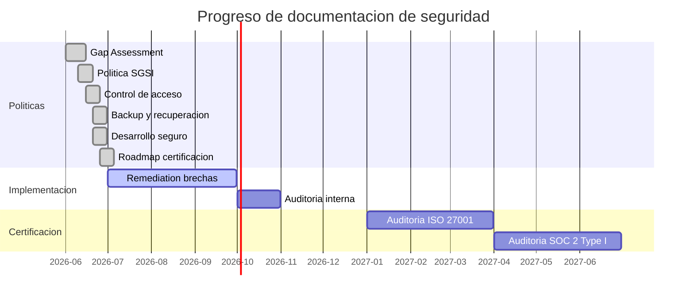

# Documentacion de Seguridad — ManttoAI

## Proposito

Este directorio contiene la documentacion del sistema de gestion de seguridad de la informacion (SGSI) de ManttoAI. Su objetivo es establecer las politicas, procedimientos y controles necesarios para proteger la confidencialidad, integridad y disponibilidad de los activos de informacion de la plataforma.

Esta documentacion sirve como base para la certificacion **ISO/IEC 27001:2022** y **SOC 2 Type I**, alineada con los requisitos academicos del proyecto INACAP y la proyeccion comercial de ManttoAI como empresa.

## Indice de documentos

| # | Documento | Descripcion |
|---|---|---|
| 00 | [Evaluacion de brecha (Gap Assessment)](./00-gap-assessment.md) | Analisis de brecha contra ISO 27001 y SOC 2. Checklist de 20+ controles con estado de cumplimiento y matriz de riesgos residuales. |
| 01 | [Politica de seguridad de la informacion](./01-politica-seguridad-informacion.md) | Politica general SGSI. Alcance, objetivos, roles, clasificacion de activos, gestion de incidentes y mejora continua. |
| 02 | [Politica de control de acceso](./02-politica-control-acceso.md) | Politica de acceso y privilegios. Principio de minimo privilegio, roles (admin, tecnico, visualizador), revision trimestral y procedimientos de onboarding/offboarding. |
| 03 | [Politica de backup y recuperacion](./03-politica-backup-recuperacion.md) | Politica de backup y recuperacion ante desastres. RPO 24h, RTO 4h, backup diario, prueba de restore trimestral, retencion de 30 dias (diarios) y 12 meses (mensuales). |
| 04 | [Politica de desarrollo seguro](./04-politica-desarrollo-seguro.md) | Politica de desarrollo seguro. Mitigaciones OWASP Top 10, code review obligatorio, SAST en CI/CD, prohibicion de secrets en codigo y dependency scanning. |
| 05 | [Roadmap de certificacion](./05-roadmap-certificacion.md) | Plan de certificacion. Timeline 12 meses ISO 27001, 6 meses SOC 2 Type I. Fases, costos estimados, auditores sugeridos y presupuesto mensual. |

## Marco de referencia

- **ISO/IEC 27001:2022** — Sistema de Gestion de Seguridad de la Informacion (Anexo A, 93 controles en 4 dominios)
- **SOC 2 Type I** — Trust Services Criteria (Security, Availability, Confidentiality)
- **OWASP Top 10 (2021)** — Guia de desarrollo seguro
- **NIST SP 800-53** — Controles de seguridad referenciales
- **Ley 19.628 (Chile)** — Proteccion de datos personales

## Estado actual

## Mantenimiento

Estos documentos son documentos vivos. Se revisan y actualizan:

- **Trimestralmente** — revision de politica y controles
- **Anualmente** — revision completa del SGSI y auditoria interna
- **Post-incidente** — actualizacion de procedimientos basada en lecciones aprendidas
- **Pre-auditoria** — actualizacion pre-certificacion

Responsable: Director de Proyecto / CISO designado.

---

> Documento generado en el contexto del proyecto academico ManttoAI — INACAP.
> Proyecto: Plataforma de Monitoreo IoT por Rubro.
